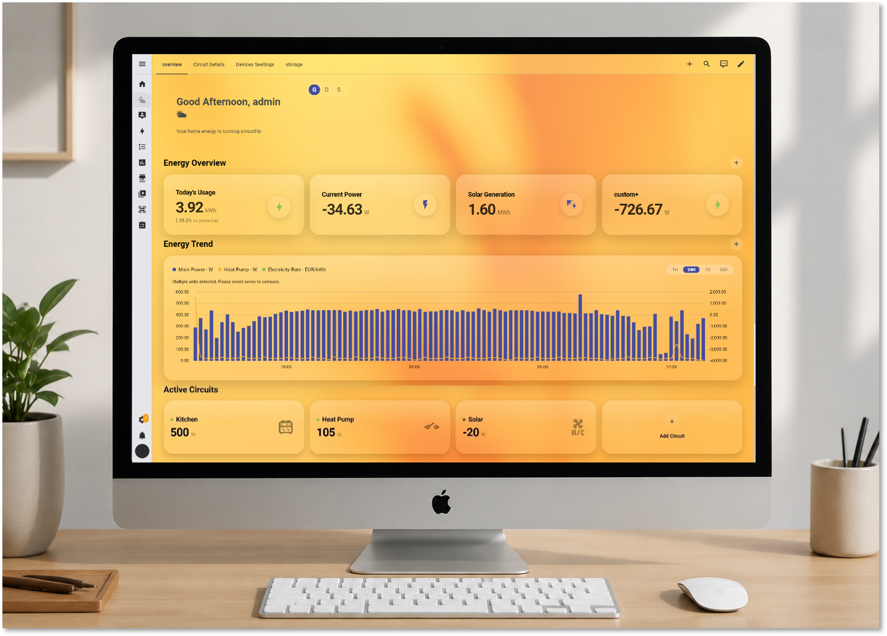

# Interactive Card

Interactive Card is a collection of Lovelace custom cards designed for Home Assistant dashboards.

The project started as a set of reusable components for a home energy dashboard and has gradually expanded to cover **key metrics, historical trends, real-time circuit monitoring, and automation scenarios**.

All cards share a consistent visual and interaction language and can be connected to different Home Assistant entities, extending the dashboard from energy data visualization to understanding and controlling home automations.

<p align="center">
  
</p>

## Explore the Cards

Interactive Card currently includes four main components. Each Card has its own page covering interactions, editing, and configuration.

### KPI Card

Keep important metrics such as real-time power, energy consumption, and energy cost visible directly on the Dashboard. Click a KPI to view more information, and use Home Assistant's native editor to manage and configure individual metrics.

[Explore KPI Card →](./docs/cards/kpi.md)

### Trend Card

Visualize how Home Assistant data changes over time and compare multiple curves within the same chart. Click the card to explore recent changes and automatic analysis, while each curve can be configured with its own display style.

[Explore Trend Card →](./docs/cards/trend.md)

### Circuit Card

Monitor the real-time power and operating status of household circuits or devices. Click a Circuit to view recent power changes on a timeline, and add custom circuits to match your own Home Assistant setup.

[Explore Circuit Card →](./docs/cards/circuit.md)

### Automation Scenario

Organize multiple related Home Assistant Automations into a complete scenario. Scenario Cards display automation status, activity, and decision information directly on the Dashboard, while clicking a card opens the Control Panel for interacting with the scenario and related devices.

[Explore Automation Scenario →](./docs/cards/automation-scenario.md)

---

## Features

Interactive Card components share a consistent configuration and interaction model and are integrated into Home Assistant's native Dashboard editing workflow.

Alongside flexible entity selection and display configuration, Trend supports multiple curves with independent styles, Circuit provides real-time power monitoring and timelines, and Automation Scenario brings automation status, decision information, and device controls directly into the Dashboard.

Three visual styles are currently available: **Glass, Native, and Solid**, with responsive layouts designed for different Dashboard sizes.

---


## Available Cards

| Card                               | Description                                 |
| ---------------------------------- | ------------------------------------------- |
| `custom:energy-kpi-card`           | Display a configurable KPI                  |
| `custom:energy-kpi-section`        | Organize and display a group of KPI cards   |
| `custom:energy-trend-card`         | Display historical data trends              |
| `custom:energy-circuit-section`    | Display real-time Circuit power information |
| `custom:energy-automation-section` | Organize and display Automation Scenarios   |
| `custom:energy-flow-diagram`       | Display energy nodes and flow connections   |
| `custom:energy-theme-selector`     | Switch Dashboard visual styles              |
| `custom:energy-settings-card`      | Configure Dashboard appearance              |

---

## Installation

### Manual Installation

Download the latest `interactive-card.js` and copy it to:

```text id="pzfvfd"
/config/www/interactive-card/interactive-card.js
```

Then open the following page in Home Assistant:

```text id="fut0m7"
Settings → Dashboards → Resources
```

<p align="center">
  
</p>

Add the following resource:

```text id="4ln7r8"
/local/interactive-card/interactive-card.js
```

Select **JavaScript Module** as the Resource Type, save the configuration, and refresh your Home Assistant Dashboard.

---

## Quick Start

After adding the resource, Interactive Card can be added through Home Assistant's Dashboard editing workflow.

For example:

```yaml id="ejxj6f"
type: custom:energy-kpi-section
title: Energy Overview
cards:
  - entity: sensor.home_power
    title: Current Power
    icon: mdi:flash
    unit: W

  - entity: sensor.home_energy_today
    title: Today's Usage
    icon: mdi:lightning-bolt
    unit: kWh
```

Replace the example entities with entities available in your Home Assistant instance.

KPI, Trend, Circuit, and Automation Scenario can all be configured through the Home Assistant Dashboard editor. More detailed usage and configuration examples are available on each Card's documentation page.

---

## Project Structure

```text id="d0tz8e"
src/
├── automation/        Automation Scenario logic
├── components/        Lovelace cards and shared UI
├── config/            Configuration and card registry
├── data/              Default card and scenario data
├── design-system/     Shared visual system
├── helpers/           Entity, chart, formatting and layout logic
├── repositories/      Configuration persistence
├── styles/            Shared card styles
├── theme/             Theme handling
├── types/             TypeScript types
└── index.ts           Build entry point

docs/
├── cards/
│   ├── kpi.md
│   ├── trend.md
│   ├── circuit.md
│   ├── automation-scenario.md
│   └── images/
│       ├── overview/
│       │   ├── first_pics.png
│       │   └── Setting_Dashboard_Resource.png
│       ├── kpi/
│       ├── trend/
│       ├── circuit/
│       └── automation/
└── architecture.md    Architecture overview

scripts/               Validation scripts
dist/                  Production build
```

For a more detailed overview of the internal architecture:

[Explore Architecture →](./docs/architecture.md)

---

## Future Plans

Interactive Card is still under active development. With KPI, Trend, Circuit, and Automation Scenario now forming the main Dashboard component set, the next stage will focus on improving stability and compatibility across different Home Assistant environments while continuing to refine editing and interaction experiences.

The project will also continue improving its documentation, repository structure, and release workflow in preparation for future HACS distribution.

---

## Feedback & Support

Bug reports, feature requests, and usage feedback are welcome through GitHub Issues.

When reporting a problem, including your Home Assistant version, browser environment, related entities, screenshots, and reproduction steps can help identify the issue more quickly.

Ideas for new Cards, Automation Scenarios, and home energy management use cases are also welcome.
