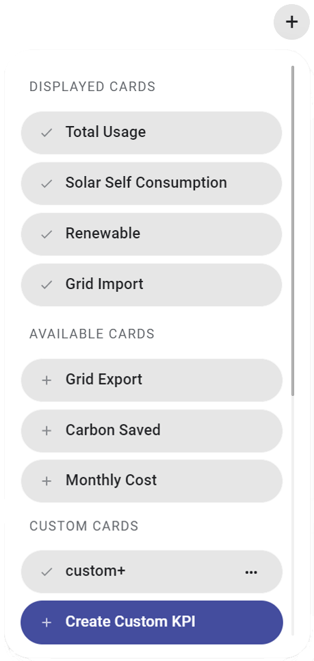
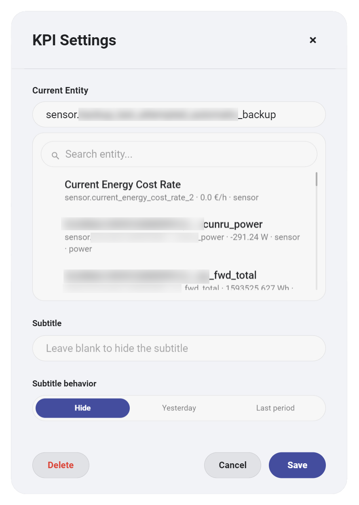
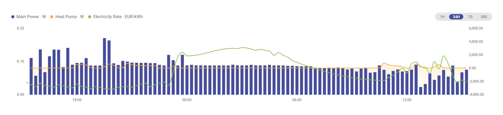
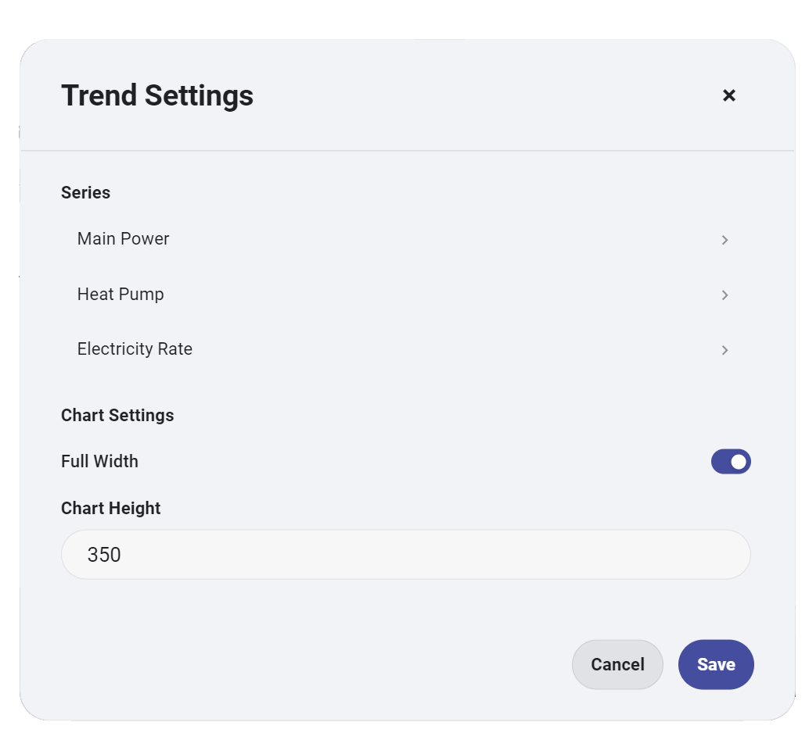
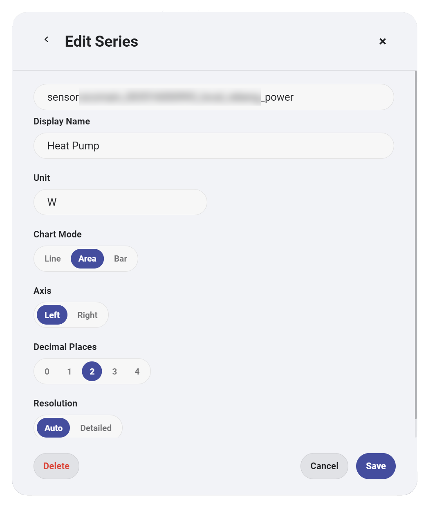
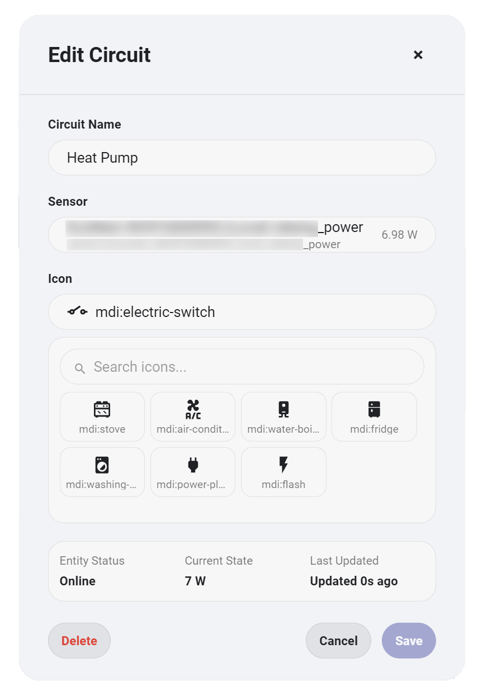

# Interactive Card

English | [简体中文](./README.zh-CN.md)

Interactive Card is a collection of custom Lovelace cards for Home Assistant, focused on energy dashboards.

The project started as a set of reusable cards for a personal dashboard and has grown into a small library for KPI display, historical trends, and circuit monitoring. The cards share a common visual system and can be configured for different Home Assistant entities.

<p align="center">
  
</p>

## Features

Interactive Card is currently built around three main parts:

- **KPI** — display energy, power, cost, and other key values
- **Trend** — visualize historical data with configurable chart series
- **Circuit** — monitor circuit-level power usage in real time

Current functionality includes:

- configurable entity selection
- custom titles, icons, units, decimals, and KPI subtitles
- automatic power and energy unit scaling
- multiple trend series with line, area, and bar modes
- automatic, left, and right trend axes
- configurable trend resolution, timeframe, and chart height
- circuit names, power sensors, and appliance icons
- browser-local persistence for dashboard edits
- Glass, Native, and Solid card styles
- responsive KPI and circuit layouts

## Screenshots

### KPI

KPI cards can be added, removed, and configured directly from the dashboard.

<p align="center">
  
  
</p>

### Trend

The trend card supports multiple series, mixed chart modes, two chart axes, and four time ranges.

<p align="center">
  
</p>

Each trend series can be configured independently, including its display name, unit, chart mode, axis, decimals, and resolution.

<p align="center">
  
  
</p>

### Circuit

Circuit entries can be renamed, assigned to a real-time power sensor, and given an appliance icon.

<p align="center">
  
</p>

## Available Cards

The bundle currently publishes the following Lovelace card types:

| Card | Description |
|---|---|
| `custom:energy-kpi-card` | Displays one configurable KPI value |
| `custom:energy-kpi-section` | Manages and displays a group of KPI cards |
| `custom:energy-trend-card` | Displays configurable historical data series |
| `custom:energy-circuit-section` | Displays circuit-level real-time power information |
| `custom:energy-flow-diagram` | Displays configured energy-flow nodes and connections |
| `custom:energy-theme-selector` | Switches between Glass, Native, and Solid card styles |
| `custom:energy-settings-card` | Provides a card-style settings surface |
| `custom:energy-ev-charging-scene` | Displays the included EV charging scene |
| `custom:energy-solar-scene` | Displays the included solar scene |
| `custom:energy-battery-scene` | Displays the included battery scene |

## Installation

### Manual installation

This repository does not currently include HACS metadata, so installation is manual.

1. Download `interactive-card.js` from the latest GitHub release, or build it from source.
2. Copy the file to:

   ```text
   /config/www/interactive-card/interactive-card.js
   ```

3. In Home Assistant, open **Settings → Dashboards → Resources**.
4. Add `/local/interactive-card/interactive-card.js` as a **JavaScript module**.
5. Reload the dashboard. If an older bundle is cached, refresh the resource URL or clear the browser cache.

## Quick Start

Add a single KPI card to a dashboard:

```yaml
type: custom:energy-kpi-card
entity: sensor.home_power
title: Current Power
icon: mdi:flash
unit: W
decimals: 2
autoScale: true
```

Replace the example entity with an entity that exists in your Home Assistant instance.

## Configuration Examples

### KPI section

```yaml
type: custom:energy-kpi-section
title: Energy Overview
cards:
  - id: current-power
    entity: sensor.home_power
    title: Current Power
    icon: mdi:flash
    unit: W
    decimals: 2
    autoScale: true
    enabled: true
    order: 0

  - id: today-energy
    entity: sensor.home_energy_today
    title: Today's Usage
    icon: mdi:lightning-bolt
    unit: kWh
    decimals: 2
    subtitle: Since 00:00
    trendMode: vs_yesterday
    enabled: true
    order: 1
```

KPI cards also support custom icon colors and historical values through the configuration fields defined by the project. Edits made from the card manager are stored locally in the browser.

### Trend card

```yaml
type: custom:energy-trend-card
id: main-energy-trend
title: Energy Trend
height: 350
fullWidth: true
timeframe: 24H
category: power
entities:
  - entity: sensor.home_power
    name: Main Power
    unit: W
    chartMode: line
    axis: left
    decimals: 2
    renderMode: smooth
    enabled: true
    order: 0

  - entity: sensor.solar_power
    name: Solar Generation
    unit: W
    chartMode: area
    axis: auto
    decimals: 2
    renderMode: high_precision
    enabled: true
    order: 1

  - entity: sensor.electricity_price
    name: Electricity Rate
    unit: EUR/kWh
    category: cost
    chartMode: bar
    axis: right
    decimals: 4
    enabled: true
    order: 2
```

Supported timeframes are `1H`, `24H`, `7D`, and `30D`. A series can use `line`, `area`, or `bar`; its axis can be `auto`, `left`, or `right`.

### Circuit section

```yaml
type: custom:energy-circuit-section
title: Active Circuits
circuits:
  - id: kitchen
    name: Kitchen
    entity: sensor.kitchen_power
    icon: mdi:stove
    enabled: true
    order: 0

  - id: hvac
    name: HVAC
    entity: sensor.hvac_power
    icon: mdi:air-conditioner
    enabled: true
    order: 1
```

The Circuit editor accepts real-time power sensors using `W`, `kW`, or `MW`. Existing invalid bindings remain visible for correction but cannot be saved again until a power sensor is selected.

## Development

Install dependencies and start the Vite development server:

```bash
npm install
npm run dev
```

Available project commands:

| Command | Purpose |
|---|---|
| `npm run dev` | Start the Vite development server |
| `npm run typecheck` | Run TypeScript without emitting files |
| `npm run verify` | Run the core verification script |
| `npm run check` | Run type checking, core verification, and a production build |
| `npm run build` | Build `dist/interactive-card.js` |
| `npm run preview` | Preview the production build with Vite |

## Project Structure

```text
src/
├── components/       Lovelace cards and shared UI components
├── config/           Configuration normalization and card registry
├── data/             Default KPI, circuit, and scene data
├── design-system/    Shared visual tokens and dialog styles
├── helpers/          Formatting, entity, chart, and layout logic
├── repositories/     Browser-local configuration persistence
├── styles/           Shared card and responsive layout styles
├── theme/            Card material and theme handling
├── types/            TypeScript configuration and view-model types
└── index.ts          Bundle entry point

docs/                 Screenshots and architecture notes
scripts/              Project verification scripts
dist/                 Generated production bundle
```

For a short overview of the internal runtime flow, see [docs/architecture.md](./docs/architecture.md).

## Roadmap

There is no formal release roadmap yet. Near-term work is focused on testing the cards with more Home Assistant configurations, keeping stored settings compatible, and preparing the repository metadata needed for a future HACS release.

## Contributing

Issues and focused pull requests are welcome. Before opening a pull request:

1. Install dependencies with `npm install`.
2. Make the change in a dedicated branch.
3. Run `npm run check`.
4. Describe the Home Assistant configuration used to verify UI or entity-related changes.
