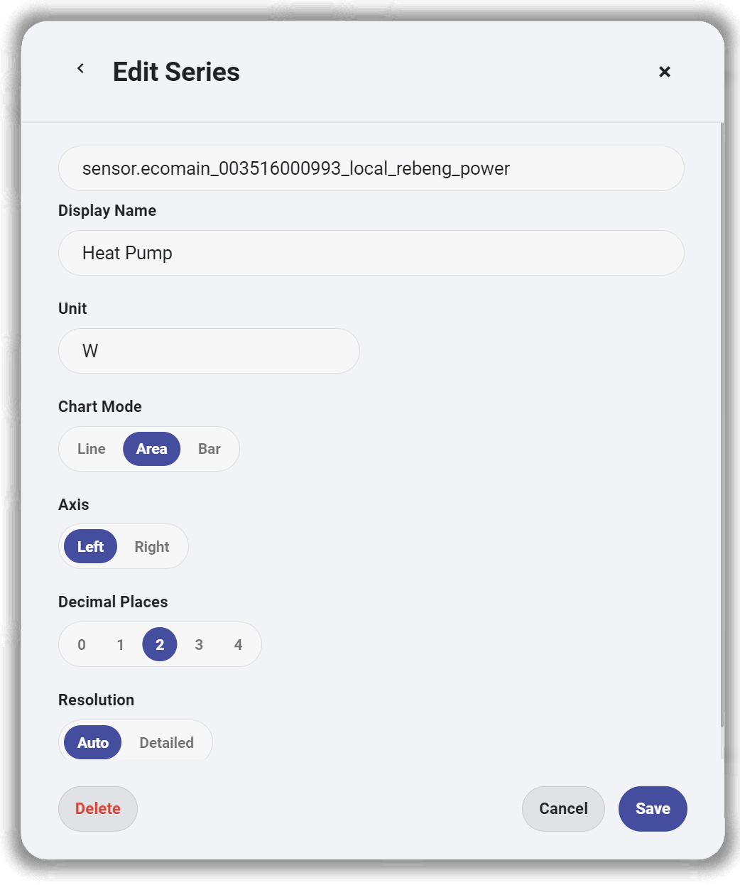

# Interactive Card

[English](./README.md) | 简体中文

Interactive Card 是一个面向 Home Assistant Lovelace 的自定义卡片库，专注于构建现代化、可配置的能源监控看板。

这个项目最初只是我为自己的 Home Assistant 能源看板开发的几张可复用卡片。随着功能不断增加，逐渐整理成了一个包含 KPI、趋势图和回路监控等组件的卡片库，希望能够让能源 Dashboard 的搭建更加简单，同时保持一致的视觉风格和良好的可配置性。

<p align="center">
  
</p>

---

# 功能

目前项目主要围绕三个核心模块展开。

## KPI

用于展示用电量、实时功率、电费等关键指标，并支持灵活配置。

支持：

- 自定义实体
- 自定义标题
- 自定义图标
- 自定义单位
- 小数位设置
- Subtitle 显示方式
- 自动单位缩放（W / kW、Wh / kWh）
- 本地保存配置

<p align="center">
  
  
</p>

---

## Trend

用于展示历史趋势数据，并支持多条曲线组合显示。

支持：

- 多实体趋势
- Line / Area / Bar 三种模式
- 左右双坐标轴
- 时间范围切换
- 小数位设置
- 数据分辨率配置
- 每条曲线独立配置

<p align="center">
  
</p>

<p align="center">
  
  
</p>

---

## Circuit

用于监控各个回路的实时功率，并支持自定义名称、图标和对应实体。

支持：

- 回路重命名
- 选择功率实体
- 内置图标选择器
- 实时状态显示
- 当前功率显示

<p align="center">
  
</p>

---

# 已提供的卡片

| 卡片 | 说明 |
|------|------|
| `custom:energy-kpi-card` | 单个 KPI 卡片 |
| `custom:energy-kpi-section` | KPI 卡片组合 |
| `custom:energy-trend-card` | 能源趋势图 |
| `custom:energy-circuit-section` | 回路监控卡片 |

---

# 安装

## 手动安装

### 1. 构建项目

```bash
npm install
npm run build
```

### 2. 将生成的 JavaScript 文件复制到 Home Assistant

复制到：

```text
/config/www/interactive-card/
```

例如：

```text
/config/www/interactive-card/interactive-card.js
```

### 3. 打开 Home Assistant

```
设置（Settings）
→ 仪表盘（Dashboards）
→ 资源（Resources）
```

### 4. 添加资源

URL：

```
/local/interactive-card/interactive-card.js
```

类型：

```
JavaScript Module
```

### 5. 保存后刷新浏览器（Ctrl + F5）

---

# 快速开始

下面是一个简单的 KPI Section 示例：

```yaml
type: custom:energy-kpi-section
title: Energy Overview

cards:
  - entity: sensor.today_energy
    title: Today's Usage
    unit: kWh
    icon: mdi:lightning-bolt

  - entity: sensor.current_power
    title: Current Power
    unit: W
    icon: mdi:flash
```

---

# 开发

克隆项目：

```bash
git clone https://github.com/YOUR_USERNAME/interactive-card.git
cd interactive-card
```

安装依赖：

```bash
npm install
```

启动开发环境：

```bash
npm run dev
```

构建发布版本：

```bash
npm run build
```

---

# 项目结构

```text
src/
├── components/
├── config/
├── data/
├── helpers/
├── styles/
├── types/
└── index.ts
```

---

# 后续计划

- 优化 Home Assistant 可视化编辑体验
- 增加更多 Dashboard 布局
- 支持 Solar / Battery 卡片
- 集成更多自动化能力
- 支持 HACS 安装
- 增加更多主题样式

---

# 参与贡献

欢迎提交 Issue 或 Pull Request。

如果遇到 Bug，建议同时提供：

- Home Assistant 版本
- 浏览器
- 卡片配置
- 控制台错误信息
- 截图

这样更方便定位问题。

---

# License

MIT License.