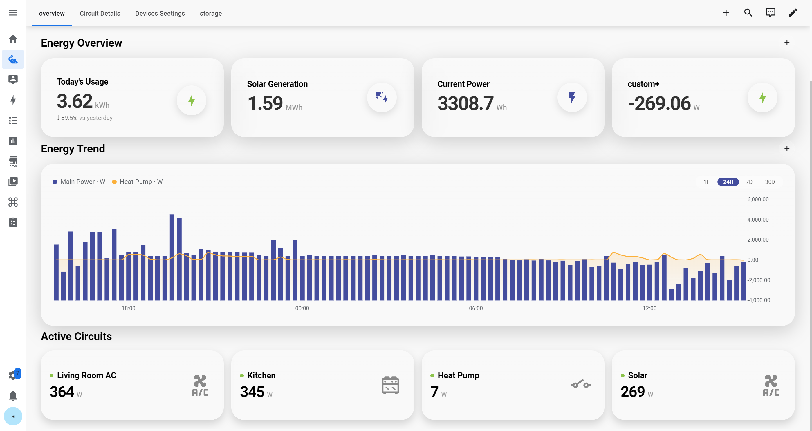
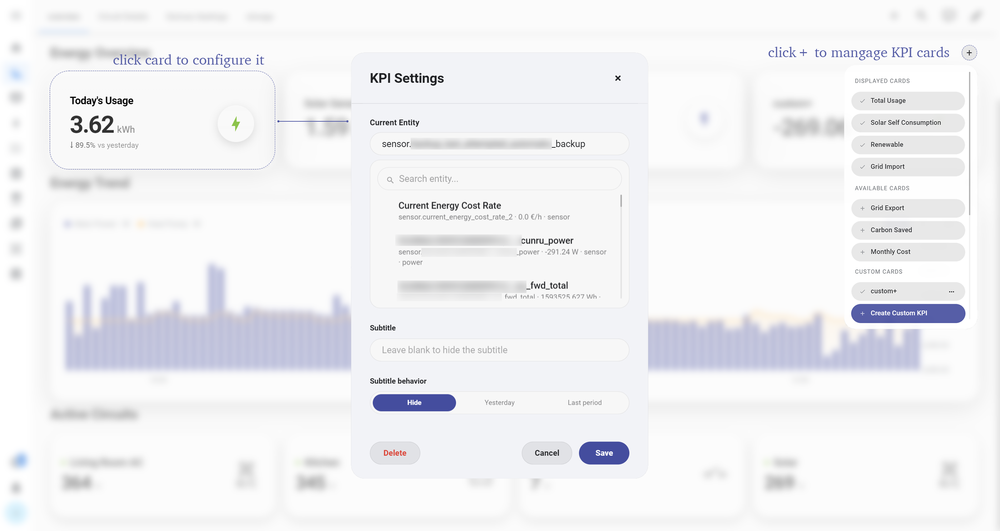
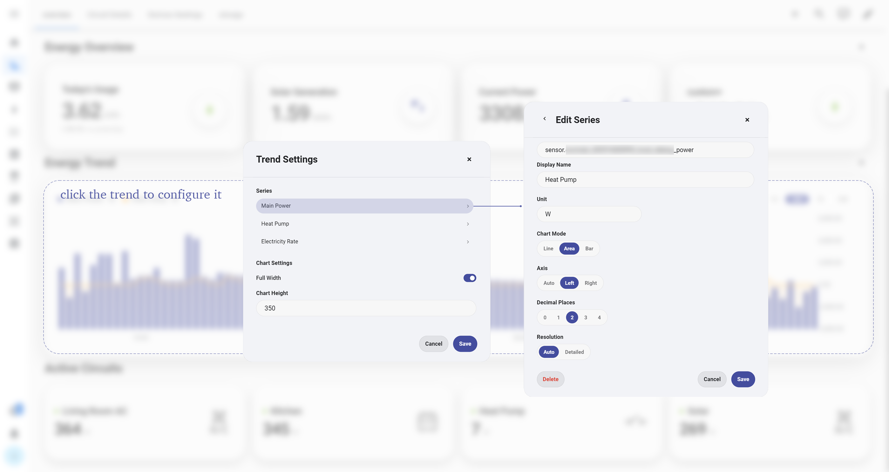

# Interactive Card

[English](./README.md) | 简体中文

Interactive Card 是一组用于 Home Assistant 能源面板的 Lovelace 自定义卡片。

这个项目最初是为了整理个人能源面板中重复使用的几个卡片组件，随着功能不断完善，逐渐扩展为一套轻量级的组件库。目前包含 KPI 数据展示、历史趋势分析以及回路功率监控等功能。

所有卡片采用统一的视觉设计语言，并支持根据 Home Assistant 中不同的实体（Entity）进行灵活配置，帮助用户更直观地查看和管理家庭能源数据。

<p align="center">
  
</p>

## 目前功能

Interactive Card 目前主要包含三个部分：

- **KPI** — 展示能耗、功率、费用等关键数值
- **Trend** — 使用可配置的多条数据序列查看历史趋势
- **Circuit** — 实时查看各回路的功率状态

目前已支持以下功能：

- 灵活选择 Home Assistant 实体（Entity）
- 自定义卡片标题、图标、单位、小数位数以及 KPI 描述信息
- 根据数据类型自动进行功率、电量单位转换与缩放
- 支持多条趋势曲线（Trend Series），并提供 Line、Area、Bar 三种图表模式
- 支持自动、左侧和右侧 Y 轴配置
- 可调整趋势数据分辨率、时间范围以及图表高度
- 支持自定义回路名称、实时功率实体以及设备图标
- 编辑后的面板配置会保存于浏览器本地，刷新后仍可保持设置
- 提供 Glass、Native、Solid 三种卡片视觉模式
- KPI 卡片与回路卡片支持响应式布局，适配不同屏幕尺寸

## 界面展示

### KPI

KPI 卡片支持在面板内直接添加、移除和编辑。
用户可以选择显示的实体，并自定义标题、单位、小数位以及副标题展示方式。

<p align="center">
  
</p>

### Trend

趋势卡片用于展示能源数据随时间变化的趋势。

支持多条数据序列（Series）同时显示，并可通过点击图例快速隐藏或显示对应曲线。


<p align="center">
  
</p>

<p align="center">
  
</p>

每条 Series 均支持独立配置显示名称、单位、图表类型、坐标轴、小数位等参数。

由于 Home Assistant 中不同传感器的数据采样频率可能存在差异，直接展示原始数据容易产生大量短时间波动。因此趋势卡片默认使用平滑显示优化趋势阅读体验，同时提供精确模式用于查看原始数据细节。

### Circuit

回路卡片用于查看家庭不同用电回路的实时功率状态。

用户可以自定义回路名称、绑定实时功率传感器，并设置对应的设备图标。通过状态指示灯和颜色反馈直观展示回路运行状态，同时提供实时功率和数据更新时间，帮助用户快速了解家庭各回路的用电情况。

<p align="center">
  
</p>

## 可用卡片

当前构建包会向 Lovelace 注册以下卡片类型：

| 卡片 | 说明 |
|---|---|
| `custom:energy-kpi-card` | 展示一个可配置的 KPI 数值 |
| `custom:energy-kpi-section` | 管理并展示一组 KPI 卡片 |
| `custom:energy-trend-card` | 展示可配置的历史数据 Series |
| `custom:energy-circuit-section` | 展示回路级实时功率信息 |
| `custom:energy-flow-diagram` | 展示配置好的能源节点与流向连接 |
| `custom:energy-theme-selector` | 切换 Glass、Native、Solid 卡片样式 |
| `custom:energy-settings-card` | 提供卡片样式设置界面 |
| `custom:energy-ev-charging-scene` | 展示项目内置的电动车充电场景 |
| `custom:energy-solar-scene` | 展示项目内置的光伏场景 |
| `custom:energy-battery-scene` | 展示项目内置的储能场景 |

## 安装

### 手动安装

当前版本支持手动安装。

1. 下载最新版本的 `interactive-card.js`。
2. 将文件复制到 Home Assistant：

```text
/config/www/interactive-card/interactive-card.js
   ```

3. 在 Home Assistant 中打开：

```text
设置 → 仪表盘 → 资源
```

<p align="center">
  
</p>

4. 添加资源：

```text
/local/interactive-card/interactive-card.js
```

资源类型选择 **JavaScript 模块**。

5. 刷新 Home Assistant 页面即可。

## 快速开始

在仪表盘中添加一张 KPI 卡片：

```yaml
type: custom:energy-kpi-card
entity: sensor.home_power
title: Current Power
icon: mdi:flash
unit: W
decimals: 2
autoScale: true
```

请将示例实体替换为你的 Home Assistant 中实际存在的实体。

## 配置示例

Interactive Card 目前包含三类主要卡片：

- KPI 数据展示
- 能源趋势分析
- 回路功率监控

### KPI 区域

KPI 卡片用于展示家庭能源核心指标，例如实时功率、今日用量、能源成本等。

```yaml
type: custom:energy-kpi-section
title: Energy Overview
cards:
  - entity: sensor.home_power
    title: Current Power
    icon: mdi:flash
    unit: W

  - entity: sensor.home_energy_today
    title: Today's Usage
    icon: mdi:lightning-bolt
    unit: kWh
```

### Trend 卡片

```yaml
type: custom:energy-trend-card
title: Energy Trend
entities:
  - entity: sensor.home_power
    name: Main Power
    unit: W
```

### Active Circuits

```yaml
type: custom:energy-circuit-section
title: Active Circuits
circuits:
  - name: Kitchen
    entity: sensor.kitchen_power
    icon: mdi:stove

  - name: HVAC
    entity: sensor.hvac_power
    icon: mdi:air-conditioner
```

## 项目结构

```text
src/
├── components/       Lovelace 卡片和共享 UI 组件
├── config/           配置标准化与卡片注册表
├── data/             默认 KPI、回路和场景数据
├── design-system/    共享视觉 Token 与 Dialog 样式
├── helpers/          格式化、实体、图表与布局逻辑
├── repositories/     浏览器本地配置持久化
├── styles/           共享卡片样式与响应式布局
├── theme/            卡片材质与主题处理
├── types/            TypeScript 配置和视图模型类型
└── index.ts          构建入口

docs/                 截图与架构说明
scripts/              项目验证脚本
dist/                 生成的生产构建
```

内部运行流程的简要说明见 [docs/architecture.md](./docs/architecture.md)。

## 未来规划

目前项目仍处于持续完善阶段，后续计划主要围绕稳定性、兼容性以及 Home Assistant 社区发布展开。

近期计划：

- 增加不同 Home Assistant 配置环境下的实际测试，提升兼容性
- 完善项目仓库结构和相关元数据，为未来发布到 HACS 做准备
- 根据社区反馈持续优化卡片交互和能源数据展示体验

未来规划：

- 接入更多智能家居设备数据，实现更完整的家庭能源管理
- 结合 Home Assistant 自动化能力，实现基于能源数据的智能控制，例如光伏、智能插座以及用电策略优化
- 开发更多可编辑的能源场景组件，让用户可以根据家庭需求创建个性化场景
- 持续完善界面设计与交互体验，提升能源数据查看、分析和管理的易用性

## 反馈与建议

欢迎通过 GitHub Issues 提交问题、功能建议或使用反馈。提交反馈时，如果方便，请提供：

- Home Assistant 版本
- 浏览器环境
- 使用的实体类型
- 问题截图或复现步骤

这些信息可以帮助更快定位问题，并持续改进项目。同时也欢迎提出新的功能想法，共同完善 Interactive Card 的能源管理体验。
