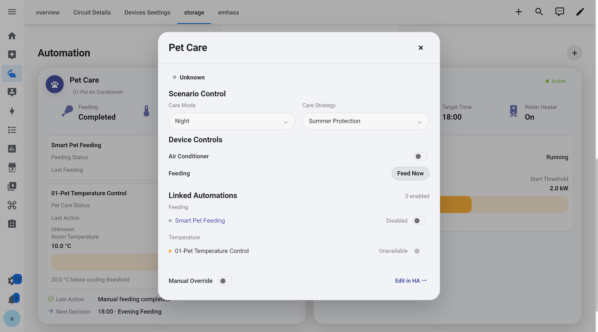
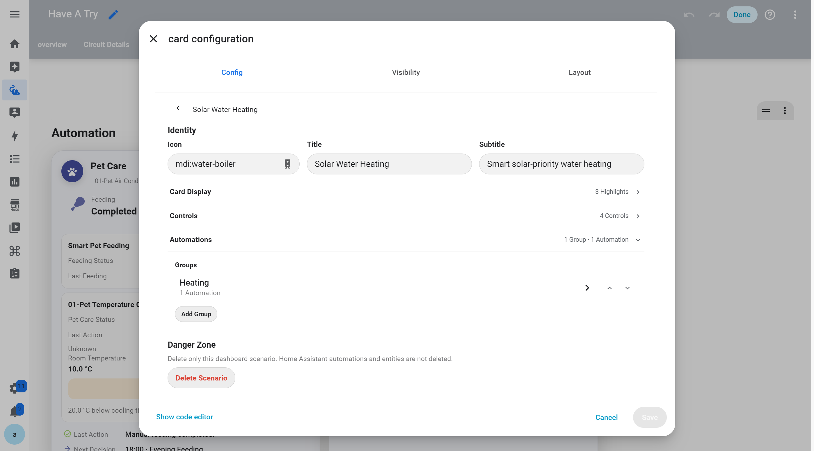

# Automation Scenario

Automation Scenario organizes multiple related Home Assistant automations into a complete scenario and brings them directly into the Dashboard.

Instead of simply showing whether an automation is enabled, a Scenario Card brings together the most important information about how the automations are currently behaving, allowing users to understand the current state, what each automation is doing, and what the system may do next.

The actual Triggers, Conditions, and Actions are still handled by Home Assistant Automations. Automation Scenario provides a more understandable and interactive Dashboard layer for their states, data, and controls.

## Understand Automation Status from the Dashboard

The Scenario Card itself is the primary view for understanding an automation scenario.

Each Scenario can display different information depending on its purpose. For example, a Pet Care Scenario can show feeding status, room temperature, the next feeding time, and the current states of both Feeding and Temperature Control automations.

This allows users to understand what is currently happening across the entire automation scenario directly from the Dashboard, without opening the Home Assistant Automation page.

## Control a Scenario

Clicking a Scenario Card opens its control panel. The Dashboard Card is designed to help users **understand what is happening**, while the Control Panel is designed to **interact with the scenario**.

<p align="center">
  
</p>

Depending on the Scenario configuration, the Control Panel can be used to:

* Adjust Scenario Controls
* Control related devices
* Perform actions
* Enable or disable Linked Automations
* Turn Manual Override on or off
* Open Home Assistant to manage related automations

## Configure in the Home Assistant Editor

In Home Assistant Dashboard edit mode, you can configure what a Scenario displays on the Dashboard and how users can interact with it.

<p align="center">
  
</p>

The Scenario Editor connects Home Assistant entities, devices, and Automations to different parts of the Scenario, including key data, automation activity, progress or threshold information, and controls.

## Relationship with Home Assistant Automations

Automation Scenario does not replace Home Assistant's automation system.

Home Assistant Automations remain responsible for:

**Trigger → Condition → Action**

Automation Scenario organizes these otherwise separate automations into a more complete scenario and provides:

**Status → Automation Activity → Decision Information → Scenario Control**

## Configuration Example

```yaml id="r1fuxz"
type: custom:energy-automation-section
title: Automation
```

Scenario content can be configured through the Home Assistant Dashboard editor and connected to existing entities and Automations.

---

[← Back to Interactive Card](../../README.md)
