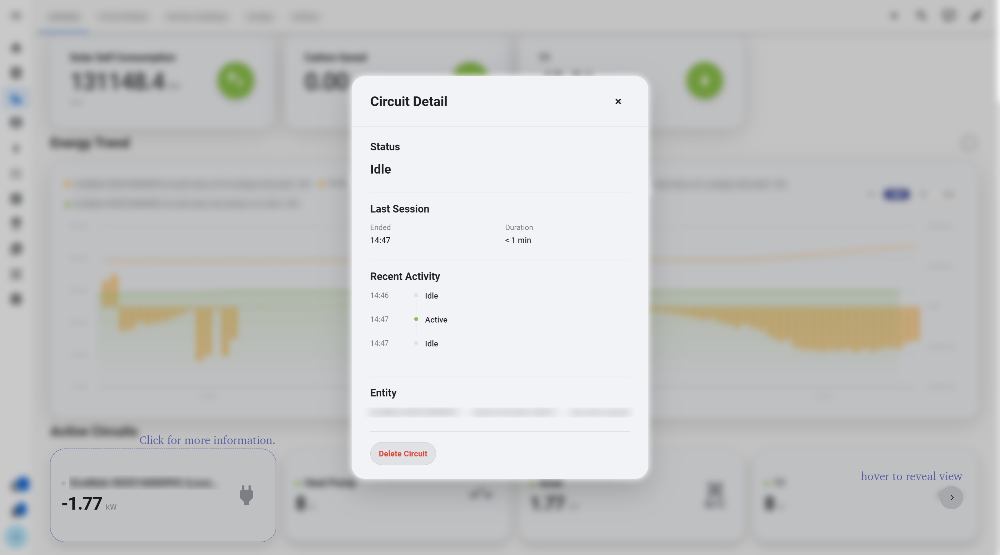
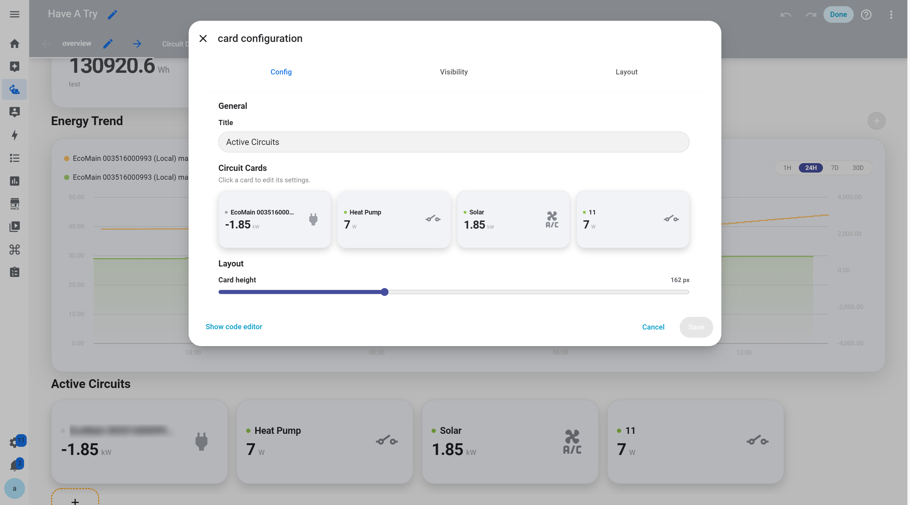

# Circuit Card

Circuit cards provide a centralized view of real-time power and operating status for different household circuits or electrical devices, making it easier to understand where power is currently being used.

Multiple Circuit cards can be organized within a single Circuit Section to monitor different rooms, devices, or electrical circuits.

## View Circuit Details

Click any Circuit card to view more detailed information about that circuit or device.

<p align="center">
  
</p>

In addition to current power and operating status, the detail view includes a timeline showing how the Circuit's power usage changes across different periods.

The timeline makes it easy to see recent usage patterns, such as when power increases or decreases and how the circuit behaves at different times.

## Add a New Circuit

At the far right of the Circuit group, an empty card is reserved for adding a new circuit, with a circular `+` button in the center. Click this Add Card to create a new custom Circuit.

Each Circuit can be configured for a specific device or electrical circuit, allowing users to build a monitoring section that matches their own Home Assistant setup.

## Configure in the Home Assistant Editor

Enter edit mode to preview the current Circuit cards and configure each Circuit individually.

<p align="center">
  
</p>

Each Circuit can be configured independently with its Home Assistant entity, display name, icon, and related display options, with changes reflected directly in the preview.

## Configuration Example

```yaml id="7lktf2"
type: custom:energy-circuit-section
title: Active Circuits
circuits:
  - name: Kitchen
    entity: sensor.kitchen_power
    icon: mdi:stove

  - name: HVAC
    entity: sensor.hvac_power
    icon: mdi:air-conditioner
```

Replace the example entities with entities available in your Home Assistant instance.

---

[← Back to Interactive Card](../../README.md)
