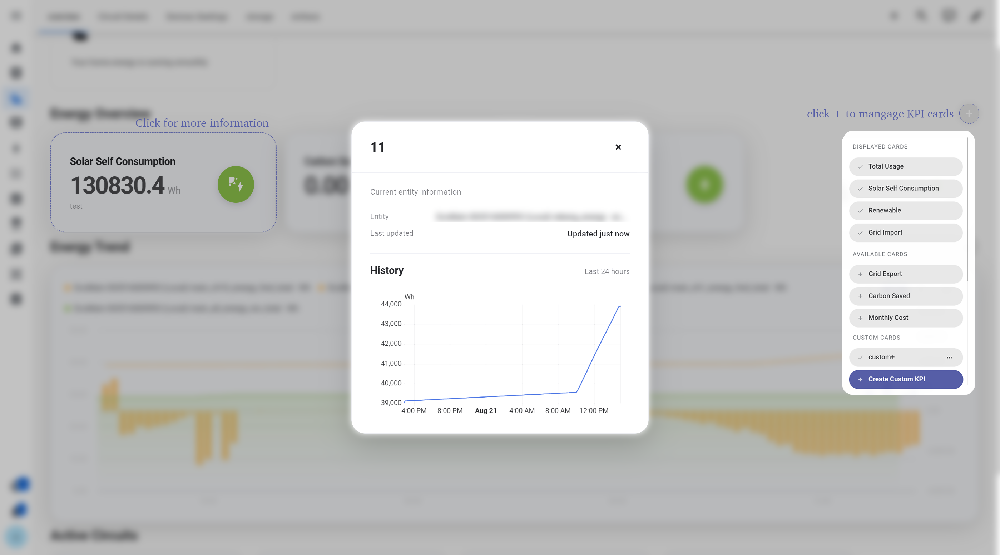
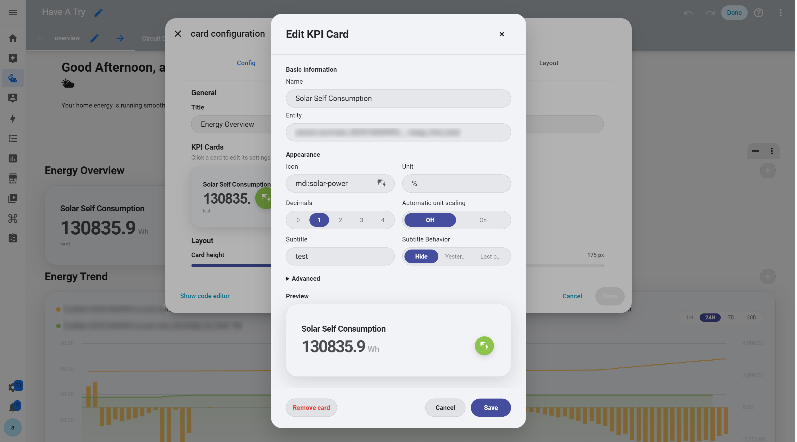

# KPI Card

KPI cards are designed to present important Home Assistant data directly on the dashboard, such as real-time power, energy consumption, energy cost, and other metrics that users want to monitor regularly.

Multiple KPI cards can be organized within a single KPI Section, keeping key information compact while maintaining a consistent visual and interaction experience across different metrics.

## View KPI Details

Click any KPI card on the dashboard to view more detailed information about that metric.

<p align="center">
  
</p>

During everyday use, the dashboard keeps the most important values and states visible at a glance. When more information is needed, clicking a KPI opens its detailed view.

## Add and Manage KPI Cards

Use the `+` button in the top-right corner of the KPI Section to manage the cards currently displayed.

Through this menu, you can:

* Add new KPI cards
* Remove existing KPI cards
* Add custom cards

This allows each KPI Section to be adapted to different Home Assistant setups instead of relying on a fixed set of predefined metrics.

## Configure in the Home Assistant Editor

KPI Section configuration is integrated into Home Assistant's native dashboard editing workflow.

Enter Dashboard edit mode and open the KPI Section to see a live preview of all KPI cards in the section.

<p align="center">
  
</p>

Each KPI card in the preview can be clicked directly.

Select the KPI you want to modify to edit its individual settings, including:

* Home Assistant entity
* Display name
* Icon
* Unit
* Decimal places
* Supporting description

Changes can be reviewed directly in the editor preview, making it easier to see how each KPI will appear on the final dashboard.

## Configuration

A KPI Section organizes multiple KPI cards, with each card connected to its own Home Assistant entity.

For example:

```yaml
type: custom:energy-kpi-section
title: Energy Overview
cards:
  - entity: sensor.home_power
    title: Current Power
    icon: mdi:flash
    unit: W

  - entity: sensor.home_energy_today
    title: Today's Usage
    icon: mdi:lightning-bolt
    unit: kWh
```

Replace the example entities with entities available in your Home Assistant instance.

---

[← Back to Interactive Card](../../README.md)
