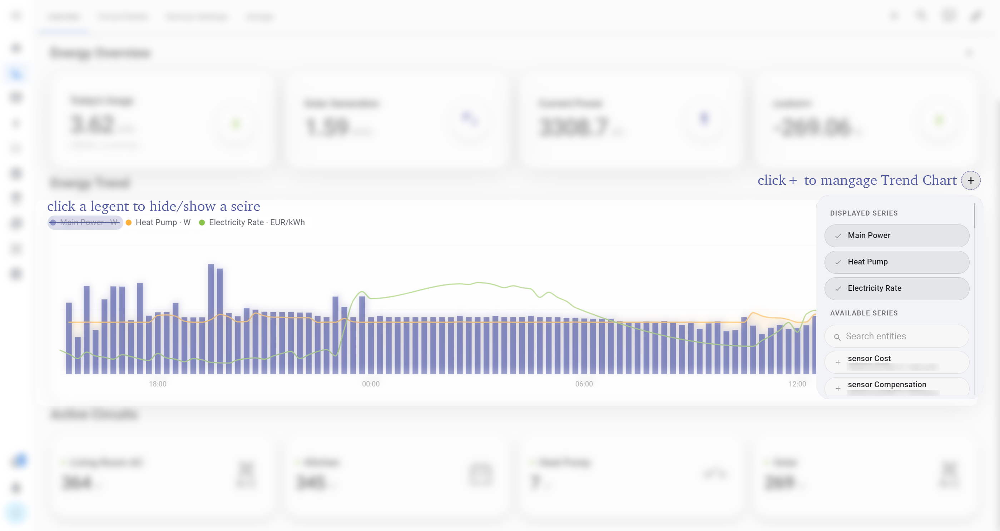
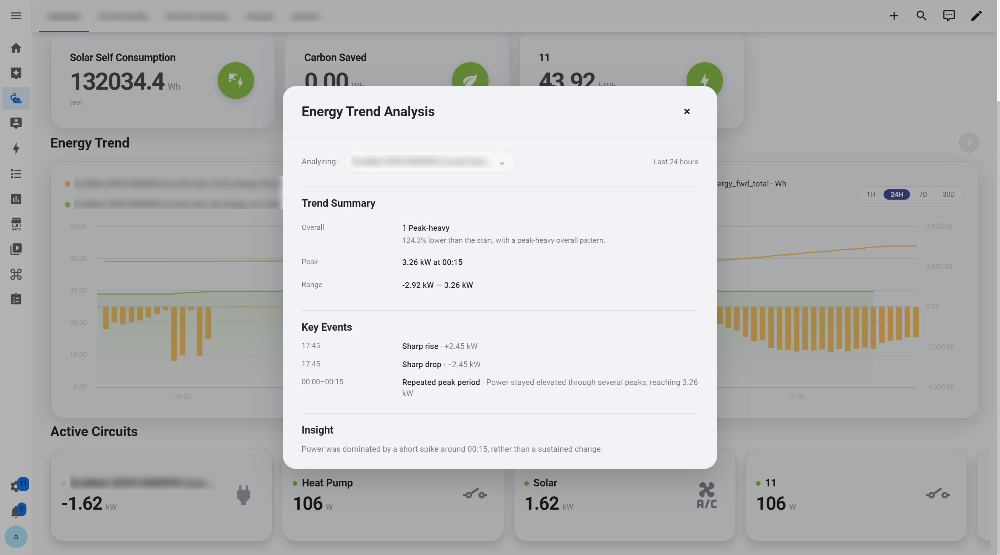
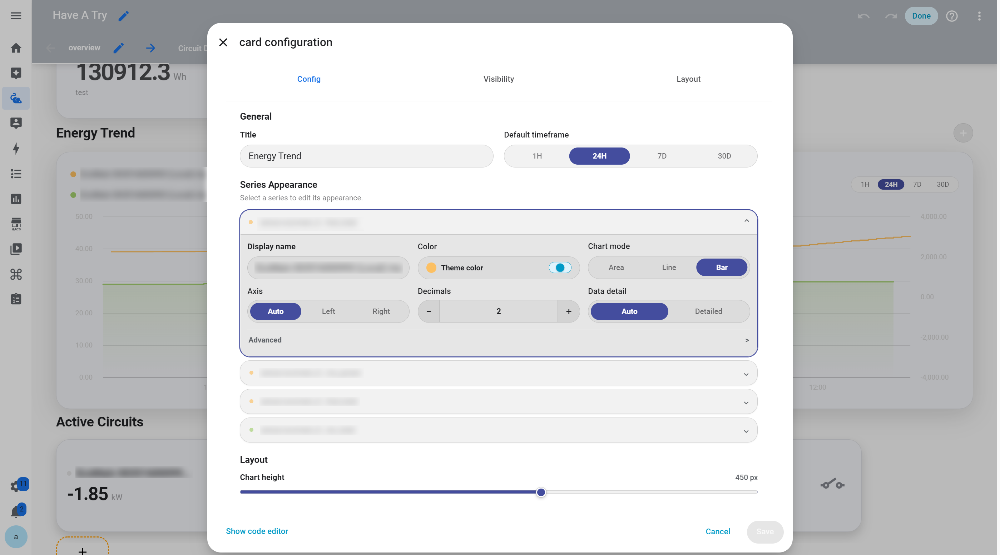

# Trend Card

The Trend Card visualizes how Home Assistant data changes over time and supports multiple curves within the same chart for comparison.

It can be used to monitor household energy consumption, real-time power, solar generation, energy costs, and other Home Assistant entities with historical data, allowing users to see not only the current value but also how the data changes over time.

<p align="center">
  
</p>

## View Recent Changes

Click the Trend Card to view more detailed information about recent data changes.

<p align="center">
  
</p>

In addition to the trend data itself, the detail view provides automatic analysis based on recent changes, helping users understand what has been happening without relying only on raw historical data.

## Add and Manage Curves

Use the `+` button in the top-right corner of the Trend Card to manage the curves displayed in the current chart.

Through this menu, you can:

* Add new curves
* Remove existing curves
* Add custom curves

Each curve can be connected to a Home Assistant entity, allowing different data sources to be displayed and compared over time within the same Trend Card.

The legend can be used to quickly show or hide individual curves without removing or changing their configuration. When a chart contains multiple data sources, users can temporarily focus on one or several curves and restore the full comparison whenever needed.

## Configure in the Home Assistant Editor

Trend Card configuration is integrated into Home Assistant's native dashboard editing workflow.

Enter Dashboard edit mode and open the Trend Card to see a live preview of the chart while adjusting both the overall chart and individual curve settings.

<p align="center">
  
</p>

Each curve (Series) can be configured independently. This means curves within the same Trend Card do not need to share the same visual style and can be adjusted individually based on the characteristics of each data source.

## Data Display

Different Home Assistant entities may update at different frequencies, and raw historical data can contain significant short-term fluctuations.

The Trend Card provides different display and precision options, allowing users to choose between a clearer overall trend and more detailed data depending on their needs.

For everyday use, the chart provides a quick view of how data changes over time. When more context is needed, users can click the card to explore recent changes and automatic analysis.

## Configuration Example

```yaml
type: custom:energy-trend-card
title: Energy Trend
entities:
  - entity: sensor.home_power
    name: Main Power
    unit: W
```

Use the `+` button to add more curves to the current Trend Card, then configure the appearance of each curve individually in the Home Assistant editor.

---

[← Back to Interactive Card](../../README.md)
